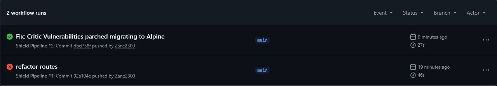

# 🛡️ The Shield Pipeline: DevSecOps with GitHub Actions and Trivy

This project implements a secure CI/CD pipeline that audits vulnerabilities in Docker containers before allowing their deployment.

---

## 🎯 Objective
To automate security (**Shift-Left Security**) by blocking any Docker image that contains **CRITICAL** or **HIGH** vulnerabilities.

---

## 🛠️ Tech Stack
- **CI/CD:** GitHub Actions
- **Security:** Aqua Security Trivy (Vulnerability Scanner)
- **Containers:** Docker
- **Language:** Python (Flask)

---

## 🚀 Workflow
1. The developer pushes code to the repository.
2. GitHub Actions builds the Docker image.
3. **Trivy** scans the image for CVEs (Common Vulnerabilities and Exposures).
4. If severe vulnerabilities are found -> **Pipeline Fails ❌** (Block).
5. If the image is secure -> **Pipeline Passes ✅**.

---

## 📸 Execution Evidence

### 1. Detection & Blocking (Vulnerable Base Image)
The pipeline detects the usage of `python:3.6` and blocks the build due to multiple critical CVEs.

### 2. Remediation (GreenOps)
The Dockerfile is migrated to `python:3.11-alpine`. The scanner validates the security, and the pipeline turns green

---

## 📄 License

This repository is published under the **MIT License**. See the [`LICENSE`](LICENSE) file.

---

## ✍️ Autor
**Alex Rosell**
*DevSecOps and Cibersecurity*